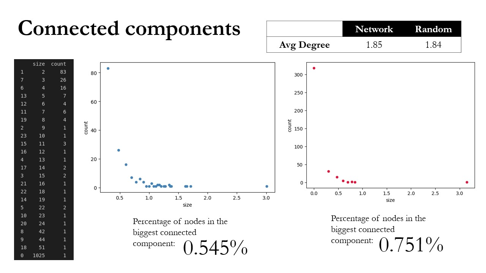

# Social network analysis of Computer Science Supervisor-Phd relationships

The directory hosts an analysis of the [ca-Phd](https://networkrepository.com/ca-CSphd.php) network graph.

The objective of the analysis was to explore the differences in behaviour bettwen a Social Network and a comparable Random Network created through the Erdos-Rényi graph generating model. 

### Presentation preview
Following are some slides taken from the powerpoint presentation used to present the study keypoints.

